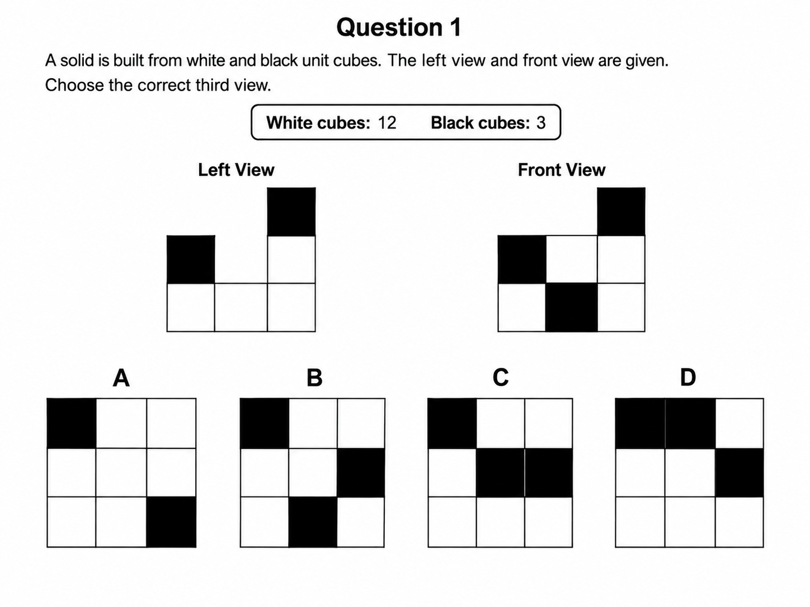

# Maximal Voxel Pruning

- [Maximal Voxel Pruning](#maximal-voxel-pruning)
  - [Problem Scope](#problem-scope)
  - [Limitations](#limitations)
  - [Human Solving Procedure](#human-solving-procedure)
  - [Usage](#usage)

_Maximal Voxel Pruning_ (_MVP_) is an algorithm for solving orthographic-view puzzles built from stacked black and white unit cubes, originally developed [for humans solving these problems on paper](#human-solving-procedure).

The central idea is to avoid reconstructing a unique 3D object. Instead, begin with the largest solid that can satisfy the known projections, then progressively remove cubes that are impossible, inconsistent, or unnecessary under visibility and cube-count constraints.

The resulting structure may remain intentionally ambiguous. The objective is to determine the possible missing projection, not necessarily to recover one unique 3D arrangement.

## Problem Scope

The algorithm is designed for problems with the following constraints:

- Two of the three views (front, left, top) are given. The missing third view is selected from multiple-choice options.
- There is one and only one correct option.
- The total numbers of white and black cubes are known.
- Cubes are stacked vertically and cannot float.



## Limitations

Most limitations are acknowledged and stem from the algorithm's primary focus on simplifying 3D reasoning into a practical 2D method for [human solving](#human-solving-procedure).

- `solver.py` may internally track multiple interpretations for correctness, but the human-facing method reduces the puzzle to repeated edits on a single 2D maximal-height table.
- `solver.py` may have high worst-case complexity due to combinatorial enumeration. However, MVP targets human-solvable puzzles rather than large-scale voxel problems, with 3×3×3 being the ideal volume.

## Human Solving Procedure

1. **Build a table based on the top view**. If the top view is unknown, write the corresponding heights along the bottom and left sides of the table. If the top view is known, use it as the table, write the known heights along one side, and use the maximum height along the other side.
   ```
       ┌───┬───┬───┐
   2   │   │   │   │
       ├───┼───┼───┤
   1   │   │   │   │
       ├───┼───┼───┤
   3   │   │   │   │
       └───┴───┴───┘
         2   2   3
   ```
1. **Fill the table**. For each cell, write $\min(x, y)$ to obtain the maximum possible column height.
   ```
       ┌───┬───┬───┐
   2   │ 2 │ 2 │ 2 │
       ├───┼───┼───┤
   1   │ 1 │ 1 │ 1 │
       ├───┼───┼───┤
   3   │ 2 │ 2 │ 3 │
       └───┴───┴───┘
         2   2   3
   ```
1. **Remove unnecessary cubes**. Remove cubes that are absent from both the table and all answer options.
   ```
   ┌───┬───┬───┐
   │ 2 │ 2 │ 2 │
   ├───┼───┼───┤ No cubes absent from all options
   │ 1 │ 1 │ 1 │ No change in this step
   ├───┼───┼───┤
   │ 2 │ 2 │ 3 │
   └───┴───┴───┘
   ```
1. **Mark the black cubes**. Determine their possible positions from the known views. If a position is uncertain, place the cube at the nearest edge as the default working position.
   ```
   ┌───┬───┬───┐
   │ 2*│ 2 │ 2 │
   ├───┼───┼───┤
   │ 1 │ 1 │ 1 │
   ├───┼───┼───┤
   │ 2 │ 2*│ 3*│
   └───┴───┴───┘
   ```
1. **Match black cubes between views**. Use the total number of black cubes to determine whether black cubes seen in different views are actually the same physical cube.
   ```
   ┌───┬───┬───┐
   │ 2*│ 2 │ 2 │
   ├───┼───┼───┤ No additional merge required
   │ 1 │ 1 │ 1 │ No change in this step
   ├───┼───┼───┤
   │ 2 │ 2*│ 3*│
   └───┴───┴───┘
   ```
1. **Remove blockers**. Remove white cubes that would prevent a required black cube from being visible.
   ```
   ┌───┬───┬───┐
   │ 2*│ 2 │ 2 │
   ├───┼───┼───┤
   │ 1 │ 1 │ 1 │
   ├───┼───┼───┤
   │ 1 │ 2*│ 3*│ Bottom-left cell: 2 → 1
   └───┴───┴───┘
   ```
1. **Check the total cube count**. Count the remaining cubes and remove unnecessary white cubes that do not affect the views until the required total is reached.
   ```
   ┌───┬───┬───┐
   │ 2*│ 2 │ 2 │ = 6
   ├───┼───┼───┤      No unnecessary white cubes
   │ 1 │ 1 │ 1 │ = 3  No change in this step
   ├───┼───┼───┤
   │ 1 │ 2*│ 3*│ = 6
   └───┴───┴───┘ ────
                  15 (matched)
   ```

## Usage

Run the solver with a puzzle JSON file:

```sh
python solver.py <puzzle.json>
# python solver.py test/tests/puzzle-1.json
```

The solver prints the correct option label:

```
A
```

The puzzle shall satisfy the [problem scope](#problem-scope), and the JSON file shall follow the structure of the [example file](assets/puzzle-example.json).
